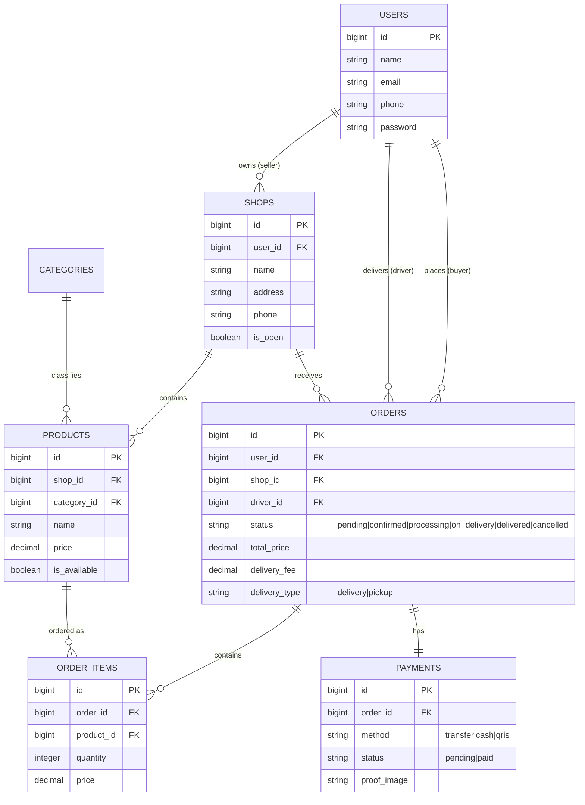

# 🍱 Jajanku Backend — Dokumentasi Teknis

Aplikasi backend berbasis **Laravel 13** untuk platform food delivery kampus **Jajanku**. Proyek ini menyediakan API RESTful untuk aplikasi mobile (Flutter/React Native) serta antarmuka web Blade responsif untuk Buyer, Seller, Driver, dan Admin.

---

## 📌 Daftar Isi
1. [Arsitektur & Teknologi](#-arsitektur--teknologi)
2. [Fitur Utama](#-fitur-utama)
3. [Skema Database & Relasi](#-skema-database--relasi)
4. [Role & Pengguna](#-role--pengguna)
5. [End-to-End Realtime Setup (Broadcasting)](#-end-to-end-realtime-setup-broadcasting)
6. [Daftar REST API Endpoints](#-daftar-rest-api-endpoints)
7. [Penanganan Ngrok & Local Tunneling](#-penanganan-ngrok--local-tunneling)
8. [Panduan Instalasi & Jalankan](#-panduan-instalasi--jalankan)

---

## 🛠️ Arsitektur & Teknologi

* **Framework Core**: Laravel 13 (PHP 8.3+)
* **Autentikasi**: Laravel Sanctum (Token-based API authentication & Stateful Web Session)
* **Otorisasi**: Spatie Laravel Permission (RBAC: `admin`, `seller`, `driver`, `buyer`)
* **Realtime Engine**: Laravel Broadcasting + Pusher PHP Server (`pusher/pusher-php-server`)
* **Database**: MySQL / SQLite (Development)
* **Frontend Web**: Laravel Blade + Bootstrap 5.3 + Pusher JS SDK

---

## ✨ Fitur Utama

### 🛒 1. Pembeli (Buyer)
* Jelajah warung & produk makanan/minuman.
* Keranjang belanja (Session-based & API stateful).
* Checkout pesanan dengan pilihan *delivery* (antar) atau *pickup* (ambil sendiri).
* Upload bukti pembayaran (Transfer BCA/QRIS).
* Live status tracking pesanan secara realtime.

### 🏪 2. Penjual (Seller / Warung)
* Kelola profil warung (Nama, Alamat, Foto, Jam Buka).
* Manajemen produk / menu (CRUD, Toggle stok habis/tersedia).
* Dashboard statistik penjualan.
* Notifikasi realtime saat ada pesanan baru masuk (`NewOrderPlaced`).
* Pemrosesan pesanan (Konfirmasi ➔ Proses ➔ Minta Driver).

### 🛵 3. Pengemudi (Driver)
* Notifikasi realtime saat ada pesanan siap diantar (`NewDriverJobAvailable`).
* Ambil (accept) pekerjaan pengiriman.
* Konfirmasi penjemputan dari toko dan konfirmasi pesanan selesai.
* Riwayat pengiriman.

### 🛡️ 4. Administrator (Admin)
* Manajemen pengguna & perizinan role.
* Pengelolaan kategori produk.
* Monitoring warung dan statistik transaksi platform.

---

## 🗄️ Skema Database & Relasi



---

## 🔴 End-to-End Realtime Setup (Broadcasting)

Fitur realtime menggunakan **Laravel Events & Broadcasting** yang terintegrasi dengan **Pusher**.

### Event Broadcast & Channel Matrix

| Event Name | Channel Name | Trigger Action | Penerima |
| :--- | :--- | :--- | :--- |
| `order.status.updated` | `private-user.{userId}` & `private-shop.{shopId}` | Perubahan status pesanan | Buyer & Seller |
| `order.new` | `private-shop.{shopId}` | Pesanan baru berhasil di-checkout | Seller / Warung |
| `driver.job.new` | `driver.jobs` (Public Channel) | Status pesanan diubah ke `on_delivery` | Semua Driver |

### Struktur Payload JSON Broadcast
* **`OrderStatusUpdated`** (`order.status.updated`):
  ```json
  {
    "order_id": 12,
    "status": "confirmed",
    "status_label": "Dikonfirmasi",
    "updated_at": "2026-08-16T15:00:00.000000Z"
  }
  ```

---

## 🌐 Daftar REST API Endpoints

Seluruh API terproteksi menggunakan token Sanctum Header: `Authorization: Bearer <TOKEN>`.

### 1. Autentikasi (`/api/auth`)
* `POST /api/auth/register` — Registrasi akun baru (Buyer, Seller, atau Driver).
* `POST /api/auth/login` — Authenticate & dapatkan Bearer Token.
* `GET /api/auth/me` — Ambil profil akun aktif.
* `POST /api/auth/logout` — Revoke token aktif.

### 2. Realtime & Channel Info (`/api/realtime`)
* `GET /api/realtime/channels` — Mengambil daftar channel Pusher yang dapat di-subscribe oleh pengguna aktif beserta Pusher App Key.

### 3. Toko & Produk Publik (`/api/shops`)
* `GET /api/shops` — Daftar warung buka.
* `GET /api/shops/{id}` — Detail warung dan menu.

### 4. Buyer Endpoints (`/api/buyer`) `[role:buyer]`
* `GET /api/buyer/orders` — Daftar pesanan pembeli.
* `POST /api/buyer/orders` — Buat pesanan baru.
* `GET /api/buyer/orders/{id}` — Detail status pesanan.
* `POST /api/buyer/orders/{id}/payment-proof` — Unggah foto bukti transfer.

### 5. Seller Endpoints (`/api/seller`) `[role:seller]`
* `GET /api/seller/orders` — Daftar pesanan masuk ke toko seller.
* `PATCH /api/seller/orders/{id}/status` — Update status pesanan (`confirmed`, `processing`, `on_delivery`, `cancelled`).
* `GET /api/seller/products` — Kelola menu toko.
* `PATCH /api/seller/products/{id}/toggle` — Ubah status ketersediaan menu (Ready / Habis).

### 6. Driver Endpoints (`/api/driver`) `[role:driver]`
* `GET /api/driver/jobs` — Daftar pesanan siap diantar.
* `PATCH /api/driver/orders/{id}/status` — Menerima pekerjaan (`on_delivery`) atau menyelesaikan pengiriman (`delivered`).

---

## 🌐 Penanganan Ngrok & Local Tunneling

Backend telah dilengkapi dengan **`App\Http\Middleware\HandleNgrok`** dan konfigurasi **TrustProxies** untuk menangani isu-isu berikut saat ditunneling melalui Ngrok:

1. **Host Header & SSL/HTTPS Mismatch**: Memaksa Laravel mengenali skema `https://` yang diberikan Ngrok Forwarding.
2. **CORS (Cross-Origin Resource Sharing)**: Konfigurasi `config/cors.php` mengizinkan origin dari domain `*.ngrok-free.app` dan `*.ngrok.io`.
3. **Ngrok Warning Page (Interstitial)**: Otomatis menginject header `ngrok-skip-browser-warning` agar tidak memblokir request API/Broadcasting.

---

## 🚀 Panduan Instalasi & Jalankan

### 1. Clone & Install Dependencies
```bash
composer install
npm install
```

### 2. Konfigurasi Lingkungan (`.env`)
Salin file `.env.example` ke `.env` dan pastikan kredensial berikut disesuaikan:

```env
APP_URL=http://localhost:8000
# Jika menggunakan Ngrok, ubah APP_URL:
# APP_URL=https://xxxx.ngrok-free.app

DB_CONNECTION=mysql
DB_HOST=127.0.0.1
DB_PORT=3306
DB_DATABASE=jajanku
DB_USERNAME=root
DB_PASSWORD=

# Broadcasting via Pusher
BROADCAST_CONNECTION=pusher
QUEUE_CONNECTION=database

PUSHER_APP_ID=your-app-id
PUSHER_APP_KEY=your-app-key
PUSHER_APP_SECRET=your-app-secret
PUSHER_APP_CLUSTER=ap1
```

### 3. Migrasi & Seeder Database
```bash
php artisan key:generate
php artisan migrate --seed
```

### 4. Jalankan Server Dev & Queue Worker
Untuk memastikan event broadcast berjalan dengan lancar, jalankan server bersama queue listener:

```bash
# Jalankan concurrently (Server + Queue + Vite)
composer run dev

# ATAU jalankan secara terpisah:
php artisan serve
php artisan queue:listen
```
