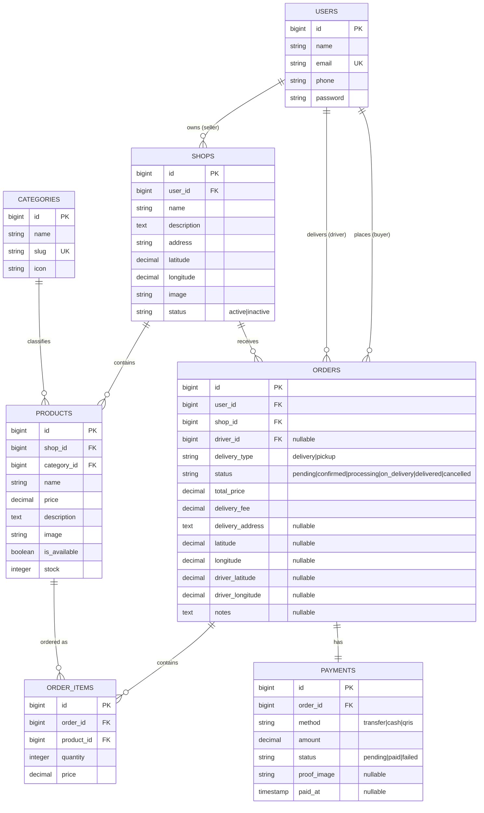

# 🍱 Jajanku — Backend API & Web Admin

> Platform food delivery kampus berbasis **Laravel 13** untuk **Warung Bu Ipa**. Menyediakan REST API untuk aplikasi mobile (Flutter/React Native) serta antarmuka web Blade responsif untuk Buyer, Seller, Driver, dan Admin.

---

## 📌 Daftar Isi

1. [Teknologi & Stack](#-teknologi--stack)
2. [Arsitektur Aplikasi](#-arsitektur-aplikasi)
3. [Fitur Utama](#-fitur-utama)
4. [Skema Database](#-skema-database)
5. [Role & Akun Demo](#-role--akun-demo)
6. [Alur Pesanan (Order Flow)](#-alur-pesanan-order-flow)
7. [Realtime Broadcasting](#-realtime-broadcasting)
8. [REST API Endpoints](#-rest-api-endpoints)
9. [Web Routes (Blade UI)](#-web-routes-blade-ui)
10. [Panduan Instalasi](#-panduan-instalasi)
11. [Menjalankan Aplikasi](#-menjalankan-aplikasi)
12. [Testing](#-testing)
13. [Ngrok & Local Tunneling](#-ngrok--local-tunneling)
14. [Struktur Proyek](#-struktur-proyek)

---

## 🛠️ Teknologi & Stack

| Layer | Teknologi |
|:---|:---|
| **Framework** | Laravel 13 (PHP 8.3+) |
| **Autentikasi** | Laravel Sanctum (Token API + Stateful Web Session) |
| **Otorisasi** | Spatie Laravel Permission (RBAC) |
| **Realtime** | Laravel Broadcasting + Pusher (PHP Server & JS SDK) |
| **Database** | MySQL (Produksi) / SQLite (Development) |
| **Frontend Web** | Laravel Blade + Bootstrap 5.3 + Leaflet.js |
| **Map/GPS** | Leaflet.js + OpenStreetMap (Nominatim Reverse Geocoding) |
| **Build Tool** | Vite |
| **Testing** | PHPUnit 12 |

---

## 🏗️ Arsitektur Aplikasi

```
app/
├── Events/                 # Broadcast events (realtime)
│   ├── DriverLocationUpdated.php
│   ├── NewDriverJobAvailable.php
│   ├── NewOrderPlaced.php
│   └── OrderStatusUpdated.php
├── Http/
│   ├── Controllers/
│   │   ├── Api/            # REST API untuk mobile
│   │   │   ├── Admin/      # Endpoint admin
│   │   │   ├── AuthController.php
│   │   │   ├── BroadcastTokenController.php
│   │   │   ├── OrderController.php
│   │   │   ├── ProductApiController.php
│   │   │   ├── SellerShopController.php
│   │   │   └── ShopController.php
│   │   ├── Buyer/          # Web UI Buyer
│   │   ├── Driver/         # Web UI Driver
│   │   └── Seller/         # Web UI Seller
│   └── Middleware/
│       └── HandleNgrok.php # Middleware tunneling
├── Models/                 # Eloquent Models
└── Services/               # Business Logic Layer
    ├── OrderService.php     # Cart, checkout, status, pickup/delivery
    ├── ProductService.php   # Manajemen produk & stok
    └── ShopService.php      # Manajemen warung
```

---

## ✨ Fitur Utama

### 🛒 Pembeli (Buyer)

- Jelajah menu Warung Bu Ipa berdasarkan kategori & pencarian
- Keranjang belanja berbasis session (web) atau stateful API (mobile)
- Checkout dengan pilihan **Antar ke Lokasi** 🛵 atau **Ambil Sendiri** 🏃
  - Antar: pin peta Leaflet untuk titik pengiriman (GPS auto-detect)
  - Ambil Sendiri: tanpa driver, langsung ke warung
- Upload bukti pembayaran (Transfer / QRIS / Cash)
- Tracking status pesanan secara realtime
  - Pesanan *antar*: live map tracking posisi driver
  - Pesanan *ambil sendiri*: info alamat warung + status "Siap Diambil"

### 🏪 Penjual / Warung (Seller)

- Dashboard statistik: total pesanan, pendapatan, produk aktif
- Manajemen menu: tambah, edit, hapus, toggle stok habis/tersedia
- Edit profil warung (nama, deskripsi, alamat, foto banner)
- Manajemen pesanan dengan alur berbeda per tipe:
  - **Pesanan Antar**: Terima → Masak → Minta Driver → Selesai
  - **Pesanan Ambil Sendiri**: Terima → Masak → Siap Diambil → Tandai Selesai
- Notifikasi realtime saat pesanan baru masuk

### 🛵 Pengemudi (Driver)

- Daftar job pengiriman yang tersedia (hanya pesanan `delivery`, bukan `pickup`)
- Ambil (accept) job pengiriman dengan mekanisme lock untuk menghindari race condition
- Live tracking pengiriman dengan peta Leaflet
- Update lokasi real-time ke pembeli via Pusher broadcasting
- Konfirmasi pesanan selesai diantar
- Riwayat pengiriman

### 🛡️ Administrator (Admin)

- Manajemen pengguna & role (`admin`, `seller`, `buyer`, `driver`)
- Manajemen kategori produk
- Monitor warung & status operasional
- Monitoring transaksi & statistik platform

---

## 🗄️ Skema Database



---

## 👤 Role & Akun Demo

Setelah menjalankan `php artisan db:seed`, akun-akun berikut tersedia:

| Role | Email | Password | Keterangan |
|:---|:---|:---|:---|
| **Admin** | `admin@jajanku.id` | `password` | Akses penuh ke semua manajemen |
| **Seller** | `pemilik@jajanku.id` | `password` | Bu Ipa — pemilik Warung Bu Ipa |
| **Buyer** | `pembeli@jajanku.id` | `password` | Budi Santoso — akun demo pembeli |
| **Driver** | `driver@jajanku.id` | `password` | Joko Driver — akun demo driver |

### Kategori & Menu (Seed)

| Kategori | Icon | Jumlah Menu |
|:---|:---:|:---|
| Gorengan | 🍢 | 24 item (Cireng, Cilok, Corndog, dll.) |
| Bundling 1 Porsi | 🍜 | 11 item (Seblak, Mie Ayam, Tomyam, dll.) |
| Minuman | 🥤 | 31 item (Pop Ice, Jasjus, Es Teh, dll.) |
| Dessert | 🍩 | 2 item (Donat Rp 1.000, Roti Rp 2.000) |

---

## 🔄 Alur Pesanan (Order Flow)

### Pesanan Antar (Delivery) 🛵

```
[Buyer] Checkout →
[System] Status: PENDING →
[Seller] Terima + Cek Bukti Bayar → Status: CONFIRMED →
[Seller] Mulai Masak → Status: PROCESSING →
[Seller] Makanan Siap: Minta Driver → Status: ON_DELIVERY →
  → NewDriverJobAvailable broadcast ke semua driver
[Driver] Ambil Job → accept order (driver_id terisi) →
[Driver] Antar ke lokasi buyer (live GPS update) →
[Driver] Konfirmasi Selesai → Status: DELIVERED
```

### Pesanan Ambil Sendiri (Pickup) 🏃

```
[Buyer] Checkout (pilih "Ambil Sendiri") →
[System] Status: PENDING (delivery_fee = 0, tanpa koordinat) →
[Seller] Terima + Cek Bukti Bayar → Status: CONFIRMED →
[Seller] Mulai Masak → Status: PROCESSING →
[Seller] Makanan Siap → Status: ON_DELIVERY ("Siap Diambil")
  → TIDAK ada notifikasi ke driver
[Seller] Buyer datang & ambil → Tandai Selesai → Status: DELIVERED
```

> **Catatan Stok**: Saat checkout, stok produk langsung dikurangi secara atomis menggunakan database transaction & row locking. Jika pesanan dibatalkan, stok dikembalikan otomatis.

---

## 📡 Realtime Broadcasting

Sistem realtime menggunakan **Laravel Broadcasting + Pusher**.

### Event & Channel Matrix

| Event Class | Nama Event (broadcast) | Channel | Trigger | Penerima |
|:---|:---|:---|:---|:---|
| `OrderStatusUpdated` | `order.status.updated` | `private-user.{userId}` & `private-shop.{shopId}` | Status pesanan berubah | Buyer & Seller |
| `NewOrderPlaced` | `order.new` | `private-shop.{shopId}` | Pesanan baru di-checkout | Seller |
| `NewDriverJobAvailable` | `driver.job.new` | `driver.jobs` (public) | Status → `on_delivery` & `delivery_type = delivery` | Semua Driver |
| `DriverLocationUpdated` | `driver.location.updated` | `private-order.{orderId}` | Driver update posisi GPS | Buyer |

### Contoh Payload JSON

**`order.status.updated`**:
```json
{
  "order_id": 12,
  "status": "on_delivery",
  "status_label": "Dalam Pengiriman",
  "updated_at": "2026-08-19T13:00:00.000000Z"
}
```

**`driver.location.updated`**:
```json
{
  "order_id": 12,
  "latitude": -6.9150,
  "longitude": 107.6100,
  "updated_at": "2026-08-19T13:05:00.000000Z"
}
```

### Konfigurasi Pusher di `.env`

```env
BROADCAST_CONNECTION=pusher
QUEUE_CONNECTION=database

PUSHER_APP_ID=your-app-id
PUSHER_APP_KEY=your-app-key
PUSHER_APP_SECRET=your-app-secret
PUSHER_APP_CLUSTER=ap1
```

---

## 🌐 REST API Endpoints

Semua endpoint (kecuali yang publik) membutuhkan header:
```
Authorization: Bearer <SANCTUM_TOKEN>
```

### Auth (`/api/auth`)

| Method | Endpoint | Keterangan |
|:---|:---|:---|
| `POST` | `/api/auth/register` | Daftar akun baru |
| `POST` | `/api/auth/login` | Login, dapatkan Bearer Token |
| `GET` | `/api/auth/me` | Profil akun aktif |
| `POST` | `/api/auth/logout` | Revoke token aktif |

### Publik

| Method | Endpoint | Keterangan |
|:---|:---|:---|
| `GET` | `/api/shops` | Daftar warung aktif |
| `GET` | `/api/shops/{id}` | Detail warung + menu |

### Realtime Info

| Method | Endpoint | Keterangan |
|:---|:---|:---|
| `GET` | `/api/realtime/channels` | Pusher App Key & daftar channel untuk mobile |

### Buyer `[role:buyer]`

| Method | Endpoint | Keterangan |
|:---|:---|:---|
| `GET` | `/api/buyer/orders` | Daftar pesanan saya |
| `POST` | `/api/buyer/orders` | Buat pesanan baru dari cart |
| `GET` | `/api/buyer/orders/{id}` | Detail & status pesanan |
| `POST` | `/api/buyer/orders/{id}/payment-proof` | Upload foto bukti transfer |

**Body `POST /api/buyer/orders`**:
```json
{
  "shop_id": 1,
  "delivery_type": "delivery",
  "delivery_address": "Gedung A, Lantai 2",
  "payment_method": "transfer",
  "notes": "Pedasnya dikurangi ya",
  "items": [
    { "product_id": 1, "quantity": 2 },
    { "product_id": 5, "quantity": 1 }
  ]
}
```

### Seller `[role:seller]`

| Method | Endpoint | Keterangan |
|:---|:---|:---|
| `GET` | `/api/seller/orders` | Pesanan masuk ke warung |
| `PATCH` | `/api/seller/orders/{id}/status` | Update status pesanan |
| `GET` | `/api/seller/products` | Daftar menu toko |
| `POST` | `/api/seller/products` | Tambah produk baru |
| `PUT` | `/api/seller/products/{id}` | Edit produk |
| `DELETE` | `/api/seller/products/{id}` | Hapus produk |
| `PATCH` | `/api/seller/products/{id}/toggle` | Toggle ketersediaan produk |
| `GET` | `/api/seller/shop` | Profil warung sendiri |
| `POST` | `/api/seller/shop` | Update profil warung |

**Body `PATCH /api/seller/orders/{id}/status`**:
```json
{ "status": "confirmed" }
```
Status yang valid: `confirmed` → `processing` → `on_delivery` → `cancelled`

### Driver `[role:driver]`

| Method | Endpoint | Keterangan |
|:---|:---|:---|
| `GET` | `/api/driver/jobs` | Job pengiriman tersedia (hanya `delivery_type=delivery`) |
| `PATCH` | `/api/driver/orders/{id}/status` | Terima job (`on_delivery`) atau selesaikan (`delivered`) |

### Admin `[role:admin]`

| Method | Endpoint | Keterangan |
|:---|:---|:---|
| `GET/POST/PUT/DELETE` | `/api/admin/users` | Manajemen pengguna |
| `GET/POST/PUT/DELETE` | `/api/admin/categories` | Manajemen kategori |
| `GET` | `/api/admin/shops` | Daftar semua warung |
| `PATCH` | `/api/admin/shops/{id}/status` | Update status warung |
| `GET` | `/api/admin/orders` | Semua transaksi |
| `GET` | `/api/admin/stats` | Statistik platform |

---

## 🖥️ Web Routes (Blade UI)

### Buyer (`/buyer`) `[auth, role:buyer]`

| URL | Keterangan |
|:---|:---|
| `/buyer/` | Beranda — jelajah menu & filter kategori |
| `/buyer/cart` | Keranjang belanja |
| `/buyer/checkout` | Form checkout (pilih antar/pickup, pin peta GPS, metode bayar) |
| `/buyer/orders` | Riwayat pesanan |
| `/buyer/orders/{id}` | Detail pesanan + live map tracking |

### Seller (`/seller`) `[auth, role:seller]`

| URL | Keterangan |
|:---|:---|
| `/seller/dashboard` | Dashboard statistik & pesanan terbaru |
| `/seller/orders` | Manajemen pesanan (filter per status) |
| `/seller/products` | Daftar menu |
| `/seller/products/create` | Tambah menu baru |
| `/seller/products/{id}/edit` | Edit menu |
| `/seller/shop/edit` | Edit profil warung |

### Driver (`/driver`) `[auth, role:driver]`

| URL | Keterangan |
|:---|:---|
| `/driver/jobs` | Job tersedia + job aktifku |
| `/driver/delivery/{id}` | Detail pengiriman aktif + live map |
| `/driver/history` | Riwayat pengiriman |

---

## 🚀 Panduan Instalasi

### Prasyarat

- PHP 8.3+
- Composer
- Node.js & NPM
- MySQL (atau SQLite untuk development)
- Akun [Pusher](https://pusher.com) (untuk fitur realtime)

### 1. Clone & Install

```bash
git clone <repo-url>
cd jajanku-app

composer install
npm install
```

### 2. Konfigurasi Environment

```bash
cp .env.example .env
php artisan key:generate
```

Edit `.env` sesuaikan variabel berikut:

```env
APP_NAME="Jajanku"
APP_URL=http://localhost:8000

# Database (MySQL)
DB_CONNECTION=mysql
DB_HOST=127.0.0.1
DB_PORT=3306
DB_DATABASE=jajanku
DB_USERNAME=root
DB_PASSWORD=

# Realtime Broadcasting
BROADCAST_CONNECTION=pusher
QUEUE_CONNECTION=database

PUSHER_APP_ID=your-app-id
PUSHER_APP_KEY=your-app-key
PUSHER_APP_SECRET=your-app-secret
PUSHER_APP_CLUSTER=ap1

# VITE (untuk frontend web)
VITE_PUSHER_APP_KEY="${PUSHER_APP_KEY}"
VITE_PUSHER_APP_CLUSTER="${PUSHER_APP_CLUSTER}"
```

### 3. Migrasi & Seed Database

```bash
# Migrasi semua tabel
php artisan migrate

# Seed akun demo, role, warung, dan 68 produk
php artisan db:seed
```

Atau sekaligus:
```bash
php artisan migrate --seed
```

### 4. Storage Link

```bash
php artisan storage:link
```

---

## ▶️ Menjalankan Aplikasi

### Mode Development (Recommended)

Jalankan semua proses sekaligus (server, queue worker, log monitor, Vite):

```bash
composer run dev
```

### Atau Jalankan Manual (Terpisah)

```bash
# Terminal 1 — Web Server
php artisan serve

# Terminal 2 — Queue Worker (wajib untuk broadcast)
php artisan queue:listen --tries=1 --timeout=0

# Terminal 3 — Vite (aset frontend)
npm run dev
```

### Setup Cepat (Fresh Install)

```bash
composer run setup
```

Ini akan otomatis: install dependencies, generate key, migrasi, dan build aset.

---

## 🧪 Testing

Proyek ini dilengkapi unit test menggunakan PHPUnit 12.

### Jalankan Semua Test

```bash
php artisan test

# Atau via Composer
composer run test
```

### Cakupan Test

| File | Kelas yang Diuji |
|:---|:---|
| `tests/Unit/Services/OrderServiceTest.php` | `OrderService` — cart, checkout, status update, pickup no-driver |
| `tests/Unit/Services/ProductServiceTest.php` | `ProductService` — CRUD & toggle stok |
| `tests/Unit/Services/ShopServiceTest.php` | `ShopService` — upsert warung |
| `tests/Unit/Events/OrderEventsTest.php` | Broadcast events — channel & payload |

### Hasil Test Terkini

```
✅ Tests:  18 passed
⏱️  Duration: ~1.5s
```

---

## 🌐 Ngrok & Local Tunneling

Untuk mengekspos backend ke internet (pengembangan mobile/testing):

### 1. Jalankan Ngrok

```bash
ngrok http 8000
```

### 2. Update `.env`

```env
APP_URL=https://xxxx.ngrok-free.app
```

### 3. Middleware `HandleNgrok`

Sudah terpasang otomatis dan menangani:
- **SSL/HTTPS Mismatch**: Memaksa Laravel membaca skema `https://` dari header Ngrok.
- **CORS**: `config/cors.php` mengizinkan origin dari `*.ngrok-free.app` dan `*.ngrok.io`.
- **Ngrok Interstitial Page**: Inject header `ngrok-skip-browser-warning` agar request API tidak diblokir halaman warning Ngrok.

---

## 📁 Struktur Proyek

```
jajanku-app/
├── app/
│   ├── Events/                     # Broadcast events (Pusher)
│   ├── Http/
│   │   ├── Controllers/
│   │   │   ├── Api/                # REST API endpoints
│   │   │   ├── Buyer/              # Web Buyer controller
│   │   │   ├── Driver/             # Web Driver controller
│   │   │   └── Seller/             # Web Seller controller
│   │   └── Middleware/
│   │       └── HandleNgrok.php
│   ├── Models/                     # Eloquent: User, Shop, Product, Order, OrderItem, Payment, Category
│   └── Services/                   # Business Logic: OrderService, ProductService, ShopService
├── database/
│   ├── migrations/                 # 13 file migrasi
│   └── seeders/
│       ├── DatabaseSeeder.php
│       ├── RoleSeeder.php          # 4 role + 4 akun demo
│       └── ShopSeeder.php          # Warung Bu Ipa + 68 produk & 4 kategori
├── resources/
│   └── views/
│       ├── buyer/                  # home, cart, checkout, orders, order-detail, shop
│       ├── seller/                 # dashboard, orders, products, product-form, shop-edit
│       ├── driver/                 # jobs, delivery, history
│       ├── admin/                  # dashboard
│       └── layouts/               # app.blade.php (shell utama)
├── routes/
│   ├── api.php                     # REST API routes
│   ├── web.php                     # Web Blade routes
│   └── channels.php                # Pusher private channel authorization
└── tests/
    └── Unit/
        ├── Events/                 # Broadcast event tests
        └── Services/               # Service layer tests
```

---

## 🔑 Ringkasan Alur Autentikasi

### Web (Session-based)
Login via `/login` → Session cookie → Middleware `auth` + `role:{role}`

### API (Token-based)
`POST /api/auth/login` → Dapatkan `{ token: "..." }` → Kirim di setiap request:
```
Authorization: Bearer <token>
```

---

## 📝 Catatan Tambahan

- **Delivery Fee**: Pesanan antar dikenakan `Rp 3.000`. Pesanan ambil sendiri gratis (`Rp 0`).
- **Stok Management**: Stok dikurangi atomis saat checkout. Stok dikembalikan saat pesanan dibatalkan.
- **Single-Shop**: Aplikasi dirancang untuk satu warung tunggal (Warung Bu Ipa). Satu akun seller mengelola satu toko.
- **Payment Flow**: Pembayaran via transfer membutuhkan upload bukti. Setelah diverifikasi seller, status berubah ke `confirmed`.
